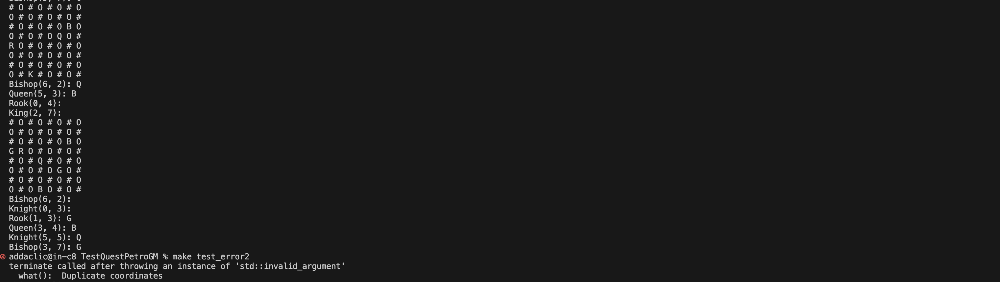

## Тестовое задание #1548
Необходимо разработать программу, которая размещает на шахматной доске фигуры и проверяет бьют ли они друг друга.
### Входные данные
Текстовый файл с описанием того, которые нужно создать. Пример:
```
king 0 0
queen 5 1
rook 1 3
bishop 3 7
knight  5 5
```
Поддерживаемые записи во входном файле:
```
king x y — король с координатами (x, y)
queen x y — ферзь с координатами (x, y)
rook x y — ладья с координатами (x, y)
bishop x y — слон с координатами (x, y)
knight x y — конь с координатами (x, y)
shadow x y —теник с координатами (x, y)
```


В исходных данных могут встречаться все фигуры кроме пешек. Количество фигур в исходных данных более 1 и не превышает 10. Фигуры могут повторяться. В рамках задачи не предполагаем, что координаты фигур в исходном файле изначально заданы корректно (в пределах доски 8x8) и все фигуры расположены в разных клетках, а значит нужно добавить проверку на эти условия.
#### Новая фигура “Теник”: Теник представляет собой таинственное существо, способное перемещаться по доске необычным способом.
#### Логика перемещения:
	•	Теник может двигаться на любое количество клеток по горизонтали, вертикали или диагонали, но только вдоль одной линии направления.
	•	Теник не может прыгать через другие фигуры, и его перемещение ограничивается препятствиями.
	•	Когда Теник совершает ход, он оставляет после себя "тень" - след, который блокирует путь другим фигурам на один ход.
Пример: Если Теник начинает свой ход из клетки D4 и двигается вправо на 3 клетки, то на клетках E4, F4 и G4 оставляются следы, которые становятся непроходимыми для других фигур.
Таким образом, Теник обладает уникальным стилем перемещения, создавая "тени" и управляя пространством на доске. Это добавляет интересные тактические возможности и требует от игроков стратегического мышления.

### Выходные данные
Отрисовка псевдографикой в консоль. Под псевдографикой понимается визуализация поля и фигур символами.
#### Реализация
Необходимо создать все фигуры, нарисовать расположение на экране, проверить бьют ли они друг друга, и вывести на экран список какая фигура кого бьёт.
Реализация и инициализация кода классов должна располагаться в отдельном Shared Project’е для C# или просто в отдельном проекте для C++.

#### Иерархия классов объектов:
```
Piece
|- King
|- Queen
|- Rook
|- Bishop
+- Knight
??? Shadow
```
Также в решении должен быть проект с примером использования написанного кода.
#### Результат
Результатом данного задания является программа, выполненная согласно условиям выше. Код должен быть расположен в github репозитории.

## Решение

#### Структура проекта
Принято решение создать основные классы: классы фигур и класс поля. \
Фигуры наследуются от шаблонного класса **Figure**

#### Получение данных

При объявлении объекта поля, происходит инициализация **char** массива, после чего вызывается метод **PlaceFigure()**, в котором валидируются входные данные из файла (количество фигур, координаты в пределах доски). Чтение данных осуществляется перенаправлением ввода.

#### Вывод поля в консоль

Осуществляется методом **Print()** класса **chessField**. Символы '#' и 'O' отображают цвет клетки, являютя пустыми ячейками (без фигур). Фигуры на доске отображаются заглавными символами наименования класса, за исключением класса **Knight**, он отображается буквой **G**.

#### Вывод результатов атак фигур

Осущестляется методом **CheckAttack()** класса **chessField**, в котором происходит "обход" поля. При встрече фигуры в массиве, создаётся объект соответствующего фигуре класса, вызывается его метод **Attack()**, который выводит в консоль буквы фигур, находящихся под "атакой". Этот метод реализован индивидуально для каждого класса, за исключением фигур **Queen**, **Rook** и **Bishop**. Так как логика атак **Queen** включает в себя алгоритмы атак перечисленных фигур. Для этого в шаблонном классе были реализованы методы атаки по *горизонтали* и *вертикали*, вызываемые в соответствующих классах.

 рис. 1. Пример вывода результата работы программы

#### Возможные доработки

При проектировании проекта были рассмотрены разные варианты реализации задач, в том числе и для разной интерпритации ТЗ. Выбранный Мной вариант описан выше.

1. В ходе выполнения проекта Мне не удалось реализовать класс фигуры **Shadow**, в виду недостаточного описания требований к нему. Возможные способы реализации в рамках задонного ТЗ:
 - Окраска клетки поля (как третье состояние: пустая/занятая фигурой/тень), с некоторыми параметрами: не может находиться под атакой, ограничевает "видимость" доски другими фигурами;
 - Является фигурой, не атакует, может "ходить" аналогично классу **Queen**, останавливается в заданной координате, если на пути нет препятствий (края доски и другие фигуры), закрашивает пройденные клетки (наследуют логику из предыдущего пункта). Сложность подобной реализации заключается в отсутствии ходов (как требования).

2. Возможно задать поле в виде массива объектов шаблонного класса, заменяя ячейки на фигуры в соответствии с входными данными.

Задача оказалась интересной, Я не уложился по времени, но смог проработать навые способы реализации объектов, рассмотреть разаду с разных сторон, продумать разные способы реализации, выбрать оптимальный по Моему мнению на данный момент.